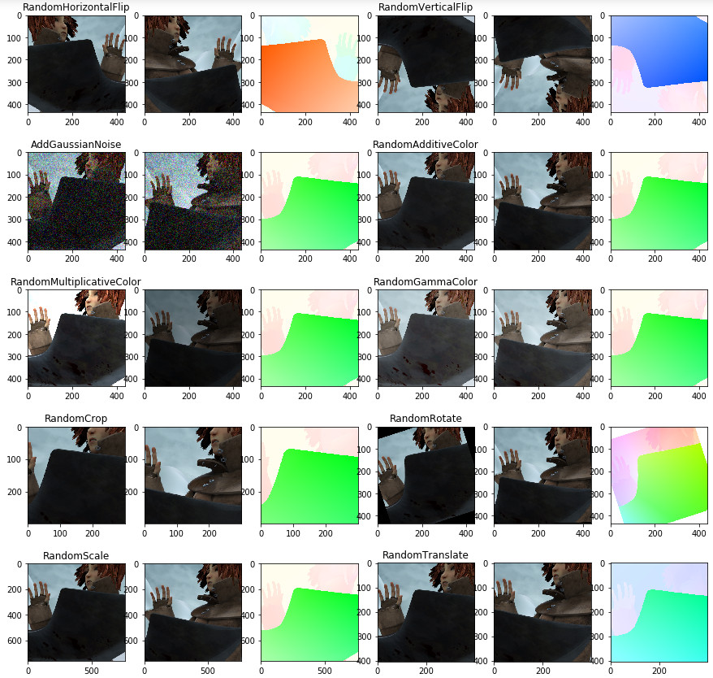

# flow-transforms-pytorch

Package implementing some common function used when performing data augmentation
to train deep optical flow networks in PyTorch. The transformations are implemented
directly in PyTorch, and they can operate over batches of images.

# Requirements

- [Python 3](https://www.python.org/) (tested on 3.7)
- [Numpy](https://www.numpy.org/)
- [PyTorch](https://pytorch.org/) >= 1.0.0 (tested on 1.3)

# Usage

Download and put `flow_transforms.py` somewhere it can be accessed from your
main project (e.g. in the same folder). Then just import it and use its functions.
A simple example is show below. A more complete example is shown in the accompanying
[Jupyter notebook demo](demo_transforms.ipynb).

```python
import flow_transforms

image1 = function_to_read_image()
image2 = function_to_read_image()
flow = function_to_read_flow()

transform = flow_transforms.Compose([
    flow_transforms.ToTensor(),  # Must come before other transforms
    flow_transforms.RandomHorizontalFlip(),
    flow_transforms.RandomAdditiveColor(stdev=1.0)
])

images_tensor, flow_tensor = transform([image1, image2], [flow])
```

The example above is generic and simple just for explanation purposes. But usually
you should use these transforms as part of the
[PyTorch data loading pipeline](https://pytorch.org/tutorials/beginner/data_loading_tutorial.html).

# Sample results



# License

This code is licensed under the [MIT License](LICENSE).

Many of the transforms were adapted from [https://github.com/ClementPinard/FlowNetPytorch](https://github.com/ClementPinard/FlowNetPytorch).

The script `flowviz.py` was taken from [https://github.com/georgegach/flowiz](https://github.com/georgegach/flowiz).